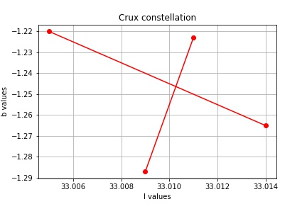
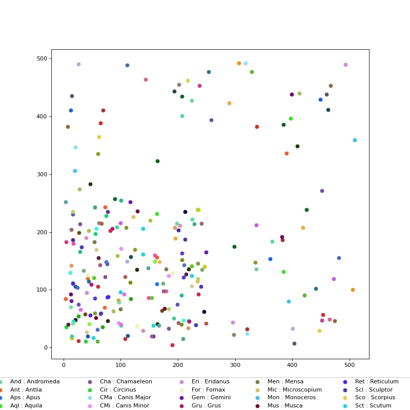

# planetary-and-exoplanetary-dataset :night_with_stars:

### Description:

This repository is created for analyzing planetary and exoplanetary datasets and extract important information as there was no combined dataset available that has all the information.

> NOTE: The analysis of the data is done using the Jupyter Notebook in order to improve data visualization.

### Datasets:
The information is extracted from the following datasets:

* [Stellarium](https://github.com/Stellarium/stellarium)
* [Skyfield](https://github.com/skyfielders/python-skyfield/blob/master/skyfield/data/hipparcos.py)
* [HYG dataset](https://github.com/astronexus/HYG-Database)
* [Exoplanets dataset](http://exoplanet.eu/catalog/)

### Information collected:
You can find the following headers in the dataset:


| hip  | ra(hms) | dec(dms) | ra(deg) | dec(deg) | magnitude | xy position | constellation names | distance(pc) | mass(ju) | radius(ju) |
| ------------- | ------------- | ------------- | ------------- | ------------- | ------------- | ------------- | ------------- | ------------- | ------------- | ------------- |
| 67522	| +13 50 6.000000480003109 |	-40 50 9.000067200005768	| 207.525 |	-40.835833 |	9.7900	| [33.016166527468506, -1.384613543882283]	|	--- | 127.2700 |	5.000000 |	0.898400 |

### Description of the files in the dataset:

#### Stellarium

* **constellation_names.csv** : contains abbreviation and full name of all the constellations
* **constellations_art.csv** : contains hip value and x y position of three boundary stars of each constellation
* **constellations_hip.csv** : contains the details about connections of stars in a constellations. 
example: [1,2,3,4,5,6], here 1 and 2 are connected, similarly 3, 4 and 5, 6 are connected
* **ssystem_major.csv** : contains orbits and physical characteristics of different planetary bodies
* **ssystem_minor.csv** : contains orbits and physical characteristics of different planetary bodies
* **base_locations.txt** : it describes various locations on earth

#### Skyfield
The values of HIP, RA and Dec were obtained from hip_main.dat file obtained from Skyfield:

* **hip_main.dat** : it is one of the largest dataset and conatins some of the most important information like:

    * hip values
    * ra (hms) and dec (dms) values
    * ra and dec values in degrees
    * magnitude of stars

#### Exoplanets 
Further data has been analysed and added using the exoplanets catalog

* **exoplanet.eu_catalog.dat** : contains information like ra, dec, distance, radius and more for 4870 exoplanets

#### HYG dataset

* **hygdata_v3.csv** : contains information like hip values, distance and more

### Additional functionalities:

Some of the useful functionalities that are provided in this repository are:

#### get l and b values (galatic coordinates) from hip values

```python
equ2gal(000.00091185, +01.08901332)
>> (33.146182060432565, 0.5695493882865139)
```

#### plotting individual constellations




#### visualizing the constellations using three boundary stars

